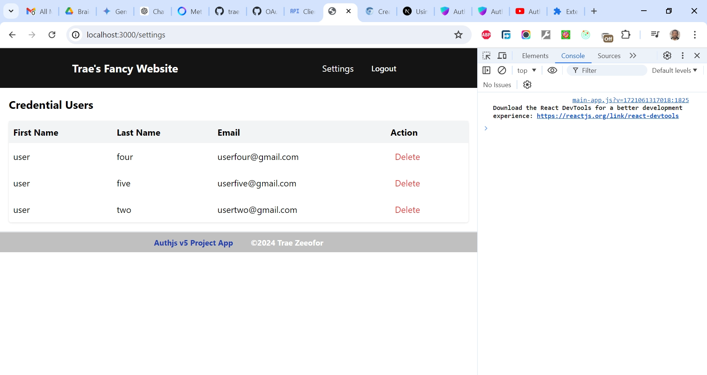

# Authjs v5 Project App in TypeScript with Magic Links

This is a solution to [Auth.js v5 Complete Course: Credentials, Google & GitHub Providers, Registration & Database Project](https://www.youtube.com/watch?v=soprdrmpO3M). I'm practicing and developing my coding competency by building projects after projects.

## Table of contents

- [Overview](#overview)
  - [The challenge](#the-challenge)
  - [Screenshot](#screenshot)
  - [Links](#links)
  - [My process](#my-process)
  - [Built with](#built-with)
  - [What I learned](#what-i-learned)
  - [Continued development](#continued-development)
  - [Useful resources](#useful-resources)
  - [Author](#author)
  - [Acknowledgments](#acknowledgments)

## Overview

### The Challenge/User Stories

Unlock the power of user authentication with Auth.js v5! This comprehensive course takes you from beginner to pro, covering everything you need to secure your application. Learn how to implement:
- Secure Logins: Create user accounts with email and password using Credentials provider.
- Social Logins: Simplify registration with Google and GitHub integrations.
- User Registration: Store user data securely in a database (implementation details explained).
- Complete Course: This video covers the entire user authentication flow, from registration to database storage.

I actually attempted this project to practice my Auth skills using TypeScript and to try to implement Magic Links Email provider. I've still not quite yet been able to achieve teh second goal, but aim to refactor code towards that later.

### Screenshot

### Links

- Solution URL: [https://github.com/traez/authjs-v5-project-app](https://github.com/traez/authjs-v5-project-app)
- Live Site URL: [https://authjs-v5-project-app-trae-zeeofors-projects.vercel.app/](https://authjs-v5-project-app-trae-zeeofors-projects.vercel.app/)

## My process

### Built with

- Semantic HTML5 markup
- CSS custom properties
- Flexbox and CSS Grid
- Mobile-first workflow
- [React](https://reactjs.org/) - JS library
- [Next.js](https://nextjs.org/) - React framework
- Tailwind CSS
- Typescript**
- Nodejs (with/without Expressjs)
- MongoDB**  
- GraphQL**    
- Redux Toolkit**  
- Auth.js (NextAuth)   

### What I learned
   
- **Shadcn UI**    
Ran `npx shadcn-ui@latest init`to install, giving me my first taste. Shadcn UI is a user interface (UI) component library designed for building modern web applications. Shadcn UI offers a collection of customizable, pre-built components that streamline the development process, ensuring consistency and enhancing user experience. It installed itself with accompanying dependencies which provide the necessary tools for styling, class management, and potentially icons within a project using Shadcn UI components.
- **Form Validation**  
Server-side validation and error handling in forms using "use server": To prevent unhandled runtime errors and stay server-side, Next.js recommends using HTML validation like `required` and `type="email"` for basic client-side form validation. This won't allow the form to be submitted if elements are missing.
- **bcryptjs**  
For bcryptjs in TypeScript, run both `npm i bcryptjs` and `npm install --save-dev @types/bcryptjs` for type definitions for bcryptjs. The best practice for salt rounds for hashing is at least 10.
- **Nullish Coalescing Operator (??)**  
The nullish coalescing (??) operator is a logical operator that returns its right-hand side operand when its left-hand side operand is null or undefined, and otherwise returns its left-hand side operand. `const expires: string = session?.expires ?? "";` This code provides a default value of an empty string if `session.expires` is `null/undefined`.
- **Next.js Edge Runtime**  
App only works in Development mode as "Mongoose does not currently support Next.js Edge Runtime". Npm run build repeatedly fails as a result.
A suggestion seems to be: "Using prisma to replace the mongoose part in your auth.ts, this issue will be fixed. Go to read the documentation on the official website of Prisma, there are some examples for mongodb.".  
See [MongoDB in NextJS: Overcoming the Edge Runtime Middleware Hurdle](https://medium.com/@chxiuy/mongodb-in-nextjs-overcoming-the-edge-runtime-middleware-hurdle-4beee31eaa30)

### Continued development

- More projects; increased competence!

### Useful resources

Stackoverflow  
YouTube  
Google  
ChatGPT

## Author

- Website - [Trae Zeeofor](https://github.com/traez)
- Twitter - [@trae_z](https://twitter.com/trae_z)

## Acknowledgments

-Jehovah that keeps breath in my lungs
